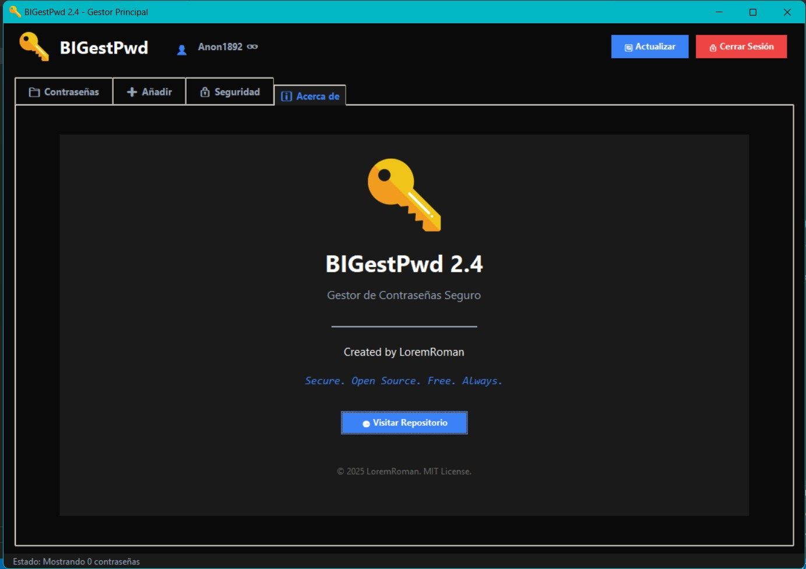
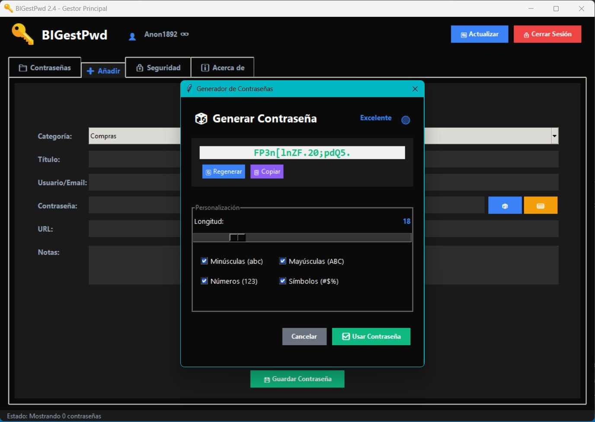
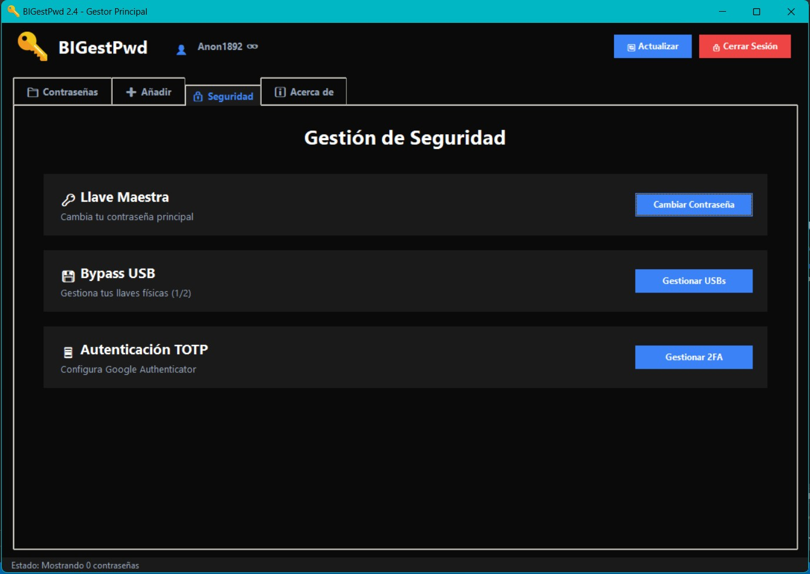

# 🛡️ BIGestPwd 2.8.3

> **Secure. Open Source. Free. Always.**

<div align="center">


<br><br>

<!-- BOTÓN DE DESCARGA -->
<a href="https://github.com/LoremRoman/BIGestPwd/releases/latest/download/Instalador_BIGestPwd_2.8.3.exe">
  
</a>
<br>
<sub><i>Requiere Windows 10/11</i></sub>

</div>

---

**BIGestPwd** es la evolución de tu gestor de contraseñas de escritorio. Diseñado bajo la filosofía **"Zero-Knowledge"**, garantiza que tus datos nunca salgan de tu dispositivo sin estar fuertemente encriptados. 

Ahora cuenta con **ejecución en segundo plano**, protección contra espionaje y un sistema de **actualizaciones automáticas** modernizado.

## ✨ Novedades en v2.8.3

¡Esta actualización cambia la forma en que usas la aplicación!

*   👻 **Modo Segundo Plano (System Tray):** La aplicación ya no se cierra, se minimiza en la bandeja del sistema (junto al reloj) para estar siempre lista.
*   👁️ **Modo Confidencial (Anti-Spy):** Nueva tecnología que vuelve la ventana **invisible** ante capturas de pantalla, grabaciones o transmisiones (Zoom/Discord).
*   ⏱️ **Protección AFK:** Si te alejas de tu PC por 15 minutos, cerramos tu sesión automáticamente y borramos la memoria RAM por seguridad.
*   🎛️ **Centro de Control:** Nuevo menú de configuración (⚙️) para personalizar el arranque con Windows, limpieza de portapapeles y más.

---

## 🔐 Características de Seguridad

| Tecnología | Descripción |
| :--- | :--- |
| **AES-256 (Fernet)** | Estándar robusto. Tus contraseñas y notas se encriptan antes de tocar el disco duro. |
| **PBKDF2-HMAC** | Derivación de claves con 100,000 iteraciones y *salts* de 32 bytes únicos. |
| **Zero-Knowledge** | La base de datos es inútil sin tu contraseña maestra. Nosotros no tenemos acceso a ella. |
| **RAM Cleaning** | El portapapeles y las variables sensibles se purgan automáticamente. |

### 🛡️ Autenticación Multifactor (MFA)
No te conformes solo con una contraseña. BIGestPwd ofrece seguridad por capas:

1.  **📱 TOTP (Google Authenticator):** Escanea el QR y genera códigos temporales offline.
2.  **💾 Bypass USB (Llave Física):** Convierte cualquier memoria USB en una llave de acceso física. Si la desconectas, nadie entra.

---

## 🎨 Galería

<div align="center">
  
</div>
<br>
<div align="center">
  
  
</div>

---

## 🚀 Instalación y Uso

### 👤 Opción A: Usuario Final (Recomendado)
El método más sencillo para empezar a proteger tus contraseñas.

1.  Haz clic en el botón de **Download for Windows** arriba 👆 o ve a la sección de **[Releases](../../releases)**.
2.  Descarga el instalador `BIGestPwd_2.8.3.exe`.
3.  Ejecútalo e instala.
4.  **¡Listo!** El programa se encargará de avisarte cuando haya nuevas versiones.

### 💻 Opción B: Desarrolladores (Código Fuente)
Si deseas auditar el código, contribuir o compilarlo tú mismo:

```bash
# 1. Clonar el repositorio
git clone https://github.com/LoremRoman/BIGestPwd.git

# 2. Entrar a la carpeta
cd BIGestPwd

# 3. Instalar dependencias
pip install -r requirements.txt

# 4. Ejecutar
python main.py
```
---

🤝 Contribuir
¡Las contribuciones son bienvenidas! Si encuentras un bug o tienes una idea:
* Haz un Fork del proyecto.
* Crea una rama (git checkout -b feature/NuevaCosa).
* Haz Commit (git commit -m 'Añadir NuevaCosa').
* Haz Push (git push origin feature/NuevaCosa).
* Abre un Pull Request.

---

<div align="center">
<sub>Desarrollado con ❤️ y Python por <b>LoremRoman</b>.</sub>
</div>
